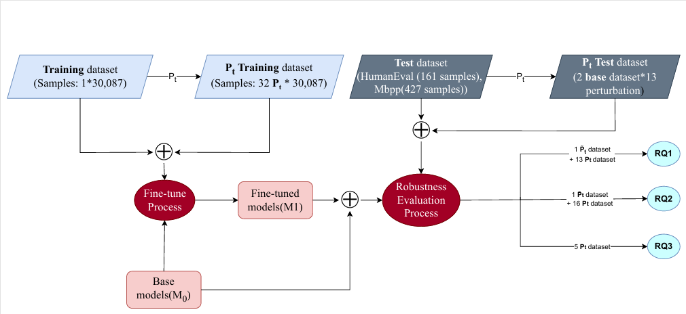

# Log Representation - Supplimental Materials
The repository contains the detailed results and replication package for the paper "Improving Robustness of Large Language Models in Code Task by Fine-tuning with Perturbed Data".

## Introduction

Our proposed approach of our experiments and our research questions:



We use this repository to answer following research questions:

RQ1: How does each type of perturbation in training data affect models’ robustness?

RQ2: How does the perturbation ratio affect models’ robustness?

RQ3: How does the size of perturbed training data affect models’ robustness?

## Setup
First, install Python dependencies:
```console
pip install -r requirements.txt
pip install -e .
```

## Training
Run the following command to fine-tune an pretrained LLM with SafeCoder:
```console
python train.py --pretrain_name starcoderbase-1b --output_name starcoderbase-1b-safecoder --datasets evol
```
Here, `--pretrain_name` specifies the base pretrained LLM, `--output_name` denotes the user-provided name of the fine-tuned model, and `--datasets` represents a list of datasets used for training (see [the datasets section](#datasets) for more details). 

## Evaluation
we consider the following benchmarks:
```console
# HumanEval, with temperature 0.2
./func_eval.sh human_eval starcoderbase-1b-safecoder-0.2 starcoderbase-1b-safecoder 0.2
python print_results.py --eval_name starcoderbase-1b-safecoder-0.2 --eval_type human_eval

# MBPP, with temperature 0.2
./func_eval.sh mbpp starcoderbase-1b-safecoder-0.2 starcoderbase-1b-safecoder 0.2
python print_results.py --eval_name starcoderbase-1b-safecoder-0.2 --eval_type mbpp
```

## Datasets
This dataset contains the unperturbed training dataset [`evol`](data_train_val/train/evol.jsonl) and 32 perturbed datasets is constructed within this work. (see [Section 4 in our paper] for more details).

## Acknowledgements

Our implimentation bases on or contains many references to following repositories:
* [SafeCoder](https://github.com/eth-sri/SafeCoder)

## Citation

